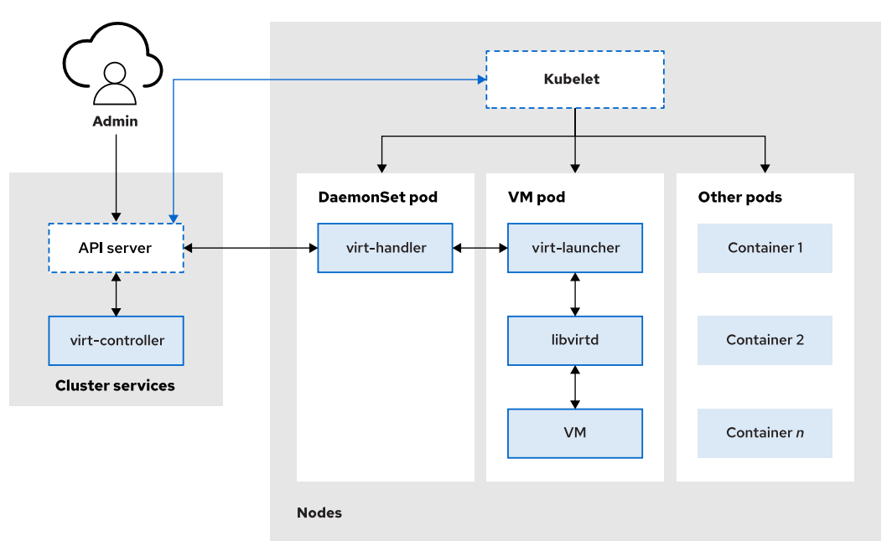

# OpenShift Virtualization Overview

## 📌 Cos'è

OpenShift Virtualization ti permette di eseguire **macchine virtuali (VM)** all'interno del tuo cluster **Kubernetes/OpenShift**, grazie al progetto [KubeVirt](https://kubevirt.io/).  
Gestisci container e VM con un'unica piattaforma!

---

## 🧱 Componenti Principali di OpenShift Virtualization

### 1. **HyperConverged Operator (HCO)**
L'**HCO** è l'operatore principale che semplifica l’installazione, l’aggiornamento e la gestione di tutti gli altri componenti necessari per la virtualizzazione all'interno di OpenShift.  
Funziona come un orchestratore centralizzato, garantendo che tutti gli operatori e le risorse siano configurati e funzionanti correttamente.

### 2. **KubeVirt**
**KubeVirt** è un’estensione di Kubernetes che permette di eseguire e gestire macchine virtuali (VM) come risorse native di Kubernetes.  
In OpenShift Virtualization, consente di eseguire VM accanto ai container, utilizzando le stesse interfacce e strumenti di gestione.

### 3. **Containerized Data Importer (CDI)**
Il **CDI** è responsabile dell’importazione e della clonazione di immagini disco per le VM.  
Facilita il provisioning delle VM importando immagini da varie fonti (es. URL HTTP o PVC esistenti) e automatizza la preparazione dello storage.

### 4. **Network Addons e Multus CNI**
- **Network Addons**: Fornisce componenti di rete aggiuntivi per migliorare le capacità di networking di OpenShift, come supporto per diversi plugin.
- **Multus CNI**: Meta-plugin per Kubernetes che consente a una VM (o pod) di avere più interfacce di rete, abilitando configurazioni avanzate.

### 5. **Componenti di KubeVirt**
- **virt-controller**: Gestisce il ciclo di vita delle VM, mantenendone lo stato desiderato.
- **virt-api**: Espone un’API RESTful per la gestione delle VM.
- **virt-handler**: Agente presente su ogni nodo, gestisce localmente le VM (es. avvio/stop).
- **virt-launcher**: Pod dedicato che esegue effettivamente la VM con QEMU/KVM. Ogni VM ha il suo pod per isolamento e sicurezza.

### 6. **VirtualMachine (VM) Custom Resource**
Una VM in OpenShift è rappresentata come una CRD (Custom Resource Definition), permettendo di definire e gestire VM come normali risorse Kubernetes.

---

Questi componenti lavorano insieme per integrare le VM nel mondo Kubernetes/OpenShift, fornendo una piattaforma unificata per gestire sia carichi di lavoro containerizzati che virtualizzati.

---

## 🗺️ Architettura



---

## 🧾 Esempio YAML

```yaml
apiVersion: kubevirt.io/v1
kind: VirtualMachine
metadata:
  name: test-vm
  namespace: my-virtualization-ns
spec:
  running: true
  template:
    metadata:
      labels:
        kubevirt.io/domain: test-vm
    spec:
      domain:
        devices:
          disks:
            - name: containerdisk
              disk:
                bus: virtio
            - name: cloudinitdisk
              disk:
                bus: virtio
        resources:
          requests:
            memory: 1Gi
      volumes:
        - name: containerdisk
          containerDisk:
            image: kubevirt/fedora-cloud-container-disk-demo:latest
        - name: cloudinitdisk
          cloudInitNoCloud:
            userData: |
              #cloud-config
              password: fedora
              chpasswd: { expire: False }
```

## 🔌 Serial Console vs VNC: Differenze chiave

| **Caratteristica**        | **Serial Console**                              | **VNC (Virtual Network Computing)**                         |
|---------------------------|--------------------------------------------------|-------------------------------------------------------------|
| 🖥️ Tipo di interfaccia     | Testuale (CLI)                                   | Grafica (GUI, come un desktop remoto)                       |
| 📡 Protocollo              | Testo puro su porta seriale virtuale            | Protocollo VNC (basato su framebuffer grafico)              |
| 🔧 Uso principale          | Debug, installazioni minime, login SSH          | Desktop remoto, installazioni GUI, troubleshooting grafico  |
| 🐚 Esperienza              | Simile a un terminale seriale (ttyS0)           | Simile a guardare lo schermo del sistema guest              |
| ⚙️ Requisiti               | Nessuno, funziona anche senza server grafico    | Richiede interfaccia grafica installata nella VM            |
| 🚀 Prestazioni             | Leggerissima, molto performante                 | Più pesante, usa più risorse                                |
| 📦 Supporto su OpenShift   | Integrata (`virtctl console`)                   | Integrata via console web GUI                               |

---

## 🧠 Quando usare l’una o l’altra?

### ✅ Serial Console
Utilissima quando:
- La VM **non ha un'interfaccia grafica**
- Usi sistemi **minimalisti** (es. Alpine, Fedora CoreOS)
- Sei in fase di **boot/debug/testo**
- Vuoi **automatizzare provisioning** o script via shell

**Comando di accesso:**
```bash
virtctl console <vm-name>

---

## 📘 Documento PDF

Per una lettura offline:  
[📄 Scarica il PDF](Managing-Virtual-Machines-with-Red-Hat-OpenShift-Virtualization.pdf)

## 🧪 Provalo!

Puoi usare [Minikube](https://minikube.sigs.k8s.io/) o [KIND](https://kind.sigs.k8s.io/) insieme a KubeVirt per sperimentare tutto in locale 🚀
